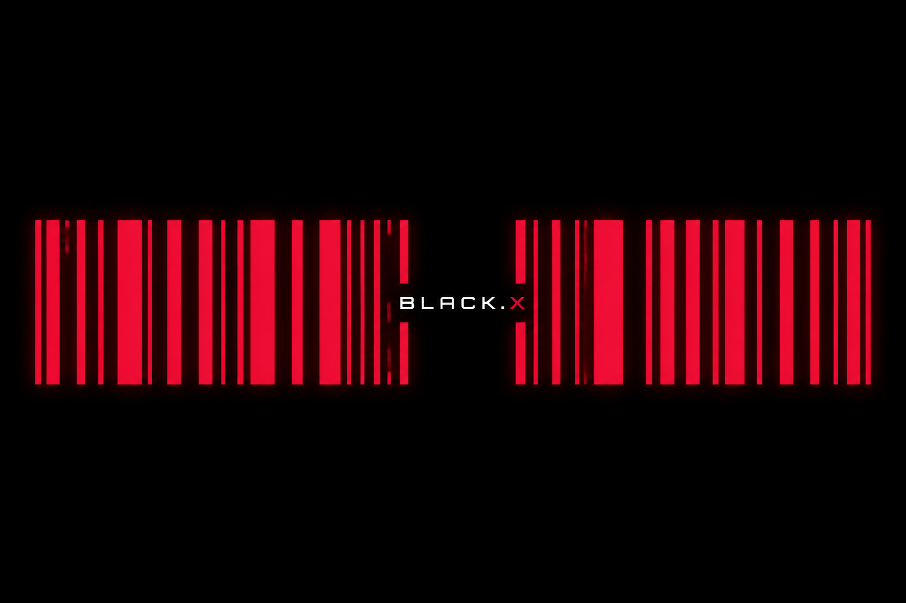

 

 

  

&nbsp;

&nbsp;

&nbsp;

  

<b>Independent developer and maker</b>

I ship private software people actually use. 
Android, Windows, web, and Unity. 
Fast. Offline when it matters. No ads. No tracking.

 

  

<b>Local Android music player with synced lyrics</b>

Your files stay on your phone. 
No account. No streaming. No ads.

  

   

  

  

<b><a href="https://github.com/DARKSIDE957/PCfix">PCfix</a></b> 
Optimize, clean, repair, and diagnose Windows

<b><a href="https://github.com/DARKSIDE957/Vtool">Vtool</a></b> 
VRChat avatar checks and safe fixes in Unity

<b><a href="https://github.com/DARKSIDE957/Pngup">Pngup</a></b> 
Pin a photo on your desktop and work behind it

<b><a href="https://github.com/DARKSIDE957/USBFix">USBFix</a></b> 
Repair stubborn USB sticks when Format fails

 

  

<b>Dark fiction by VIRUS</b>

Complete novels. Free to read.

   

  

  

Privacy first 
Built by <b>DARKSIDE957</b>

